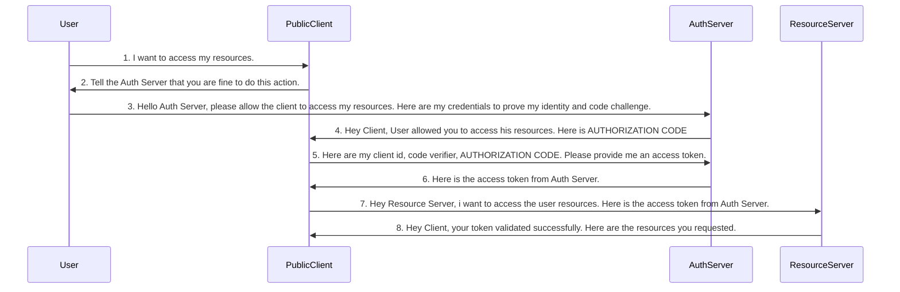

# OAuth2 Authorization Code with PKCE
Authorization Code with PKCE Grant Type flow implementation with Next.js, Spring Security and KeyCloak.

## Technologies
- Java 17
- Maven
- Spring Boot
- Spring Security
- OAuth2 Resource Server (resource server application)
- [KeyCloak](https://www.keycloak.org/) - open source identity and access management solution. (Auth Server)
- Next.js
- [Keycloak JS](https://www.npmjs.com/package/keycloak-js)

## Running the Application

1. Clone repository
```
git clone https://github.com/sevketbuyukdemir/oauth2-client-credentials.git
```
2. Run KeyCloak via Docker Desktop
- Create and start Keycloak container for the first time:
```
docker-compose up -d
```
- Start an existing Keycloak container:
```
docker-compose start
```
- Stop the running Keycloak container:
```
docker-compose stop
```
- Perform a clean restart (stops containers and removes volumes):
```
docker-compose down -v
```
3. Run Spring Boot applications

> [!TIP]
> Use this grant type flow if you have frontend applications that need end-user authentication.

## Authorization Code with PKCE grant type flow:


> [!IMPORTANT]
> In the steps 2 & 3, where client is making a request to Auth Server endpoint have to send the below important details.
>
> - **client_id:** the id which identifies Client application.
> - **redirect_uri:** the URI value which Auth server needs to redirect post successful authentication.
> - **scope:** similar to authorities. Specifies level of access that client is requesting like READ.
> - **state:** **CSRF token value** to protect from CSRF attacks.
> - **response_type:** With the value **"code"** which indicates that we want to follow **authorization code grant**.
> - **code_challenge:** XXXXXXXX - The code challenge generated as previously described.
> - **code_challenge_method:** S256 (either plain or S256)

> [!IMPORTANT]
> In the step 5, where client after received an authorization code from Auth Server, it will again make a request to Auth server for a token with the below values,
>
> - **code:** the authorization code received from the above steps.
> - **client_id & client_secret (optional):** the client credentials which are registered with auth server. **Please note that these are not user credentials**
> - **grant_type:** with the value "authorization_code" which identifies the kind of grant type is used.
> - **redirect_uri**
> - **code_verifier:** The code verifier for the PKCE request, that the app originally generated before the authorization request.
